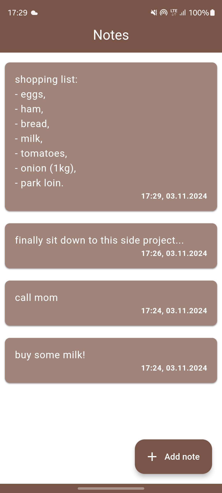
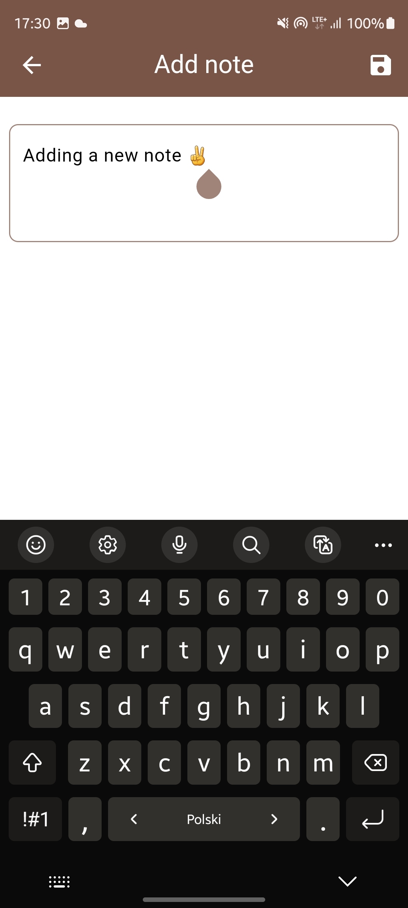
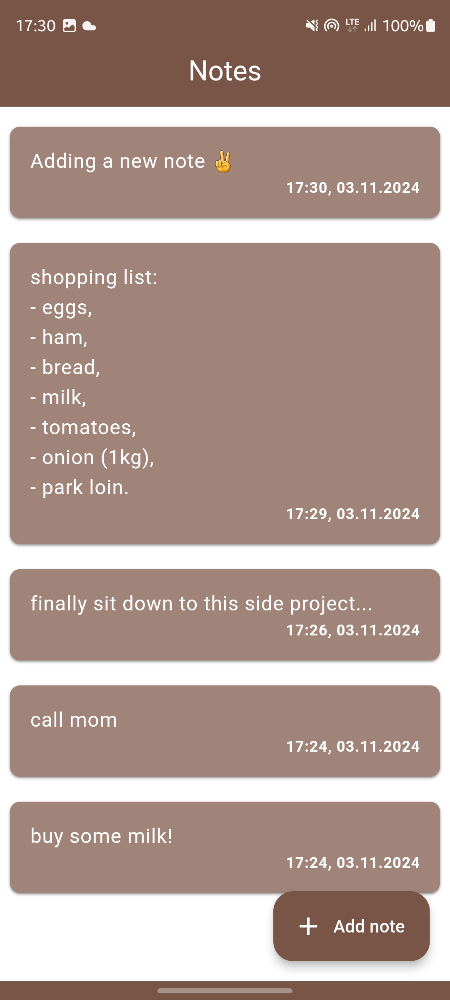
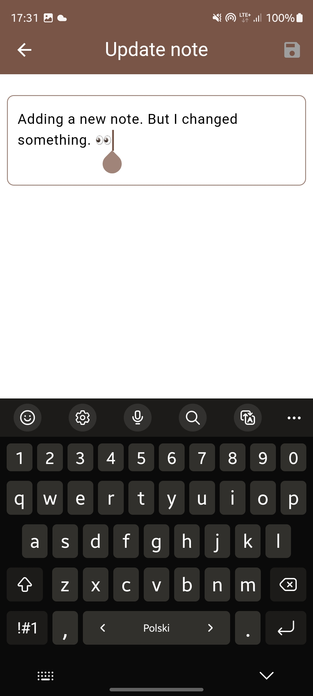
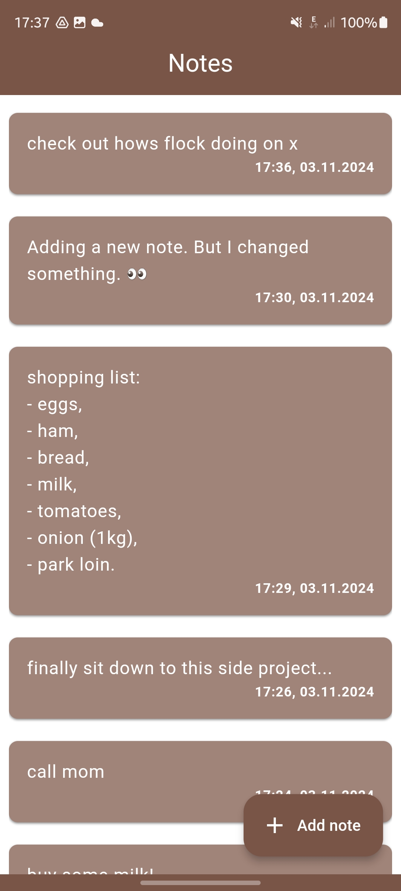
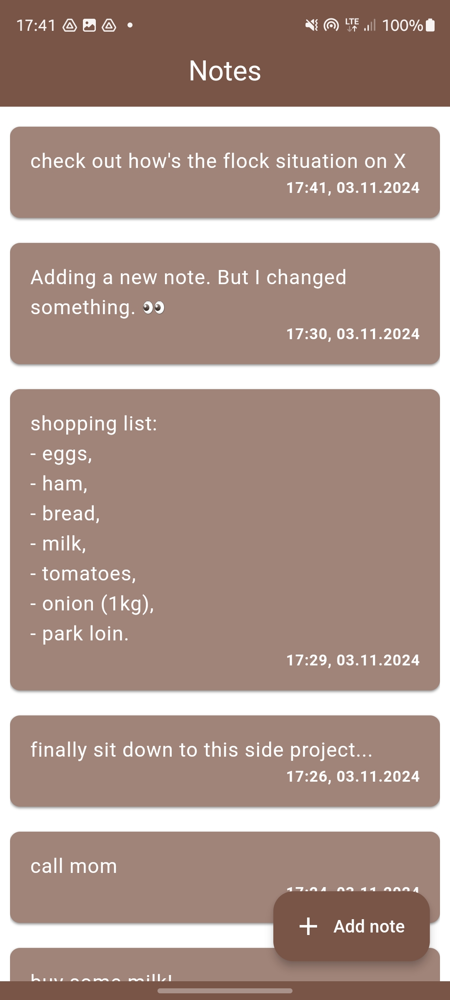
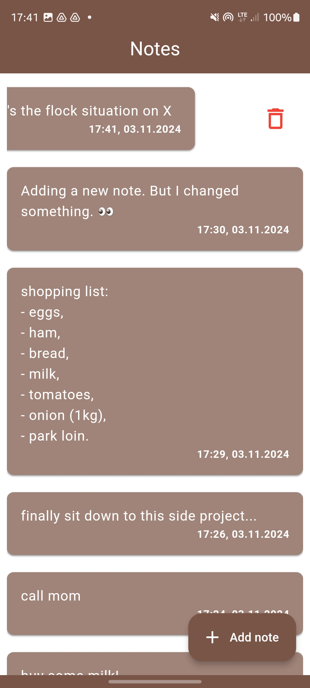
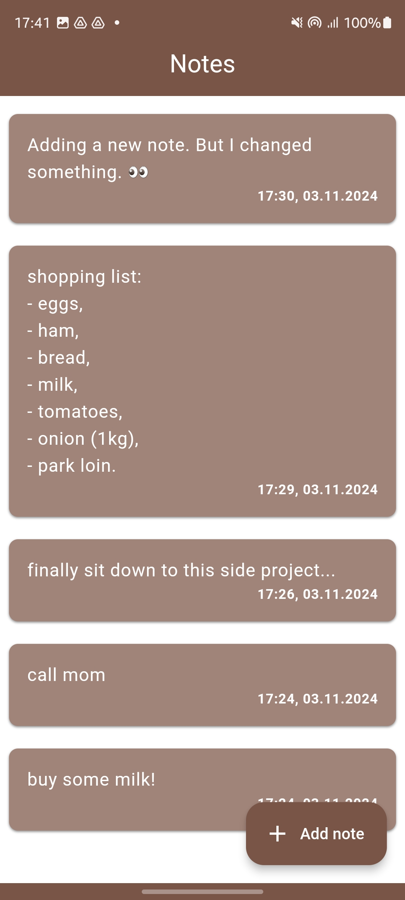

# Simple Notes App 📝✨

Welcome to a **Simple Notes App**—the app that makes jotting down notes as straightforward as it should be! Whether you’re keeping track of ideas or just need a quick reminder, this app has got you covered.

## 🌟 Features
- **List of Notes** 📜: Displays a vertical list of notes. Swipe a note to delete it with a simple gesture! Plus, there's a floating action button  to add new notes instantly. 

    

- **Add Notes** ✍️: Just type into the text field and hit 💾 in the top! Your note is stored!

    
    

- **Update Notes** ✏️: Need to make changes? Edit an existing note using the same intuitive interface as the Add Notes screen.

    
    <!--  -->
      

- **Delete Notes** 🗑️: Keep things tidy! Swipe left on any note to remove it instantly with a simple gesture.

    
    
     

### 🚀 Why this app is awesome:
- **Intuitive UI**: A clean, simple design that’s easy to use.
- **Quick Actions**: Swipe gestures for efficient note management.

## 🧰 Project Dependencies
Here’s a look at the awesome tools and packages that power the Simple Notes App:

- **flutter_bloc** 🔄: Provides a seamless way to manage state using the Bloc pattern.
- **flutter_localizations** 🌍: Makes the app ready for localization, allowing it to support multiple languages.
- **freezed** ❄️: Generates immutable data classes to keep data handling clean and safe.
- **get_it** 🧩: A dependency injection tool to keep the code loosely coupled and easy to test.
- **injectable** 💉: Automates dependency injection setup with `get_it` for cleaner, testable code using simple annotations.
- **go_router** 🗺️: For intuitive, declarative navigation throughout the app.
- **hive** 🐝: Local, lightweight storage to store notes efficiently.
- **build_runner** 🔄: Helps generate necessary files for `freezed`, `json_serializable`, and other code generators.
- **intl** 🕰️: Handles internationalization and date formatting.
- **path_provider** 📁: Gives access to commonly used device paths for saving data.
- **uuid** 🆔: Generates unique IDs for each note.
- **bloc_presentation** 🚦: For managing UI states and displaying presentations like dialogs or snack bars.
- **bloc_test** 🧪: Enables powerful testing tools to ensure our Cubit states behave correctly.
- **flutter_test** 🧪: Provides a set of testing utilities for the Flutter framework.
- **mockito** 🤖: Essential for mocking dependencies in our tests.
- **injectable_generator** ⚙️: Works with `injectable` to auto-generate DI setup.
- **json_serializable** 📦: Generates code to serialize/deserialize JSON data.

## ✅ Tests
Testing is essential, and Simple Notes App has a suite of tests! From Cubit unit tests to mock-based scenarios, the app's behavior is verified to ensure smooth functionality.

## 🚀 Get Started
To run the app:
1. Clone the repo.
2. Run `flutter pub get` to install dependencies.
3. Run `dart run build runner build --delete-conflicting-outputs` to create models, states and mocks.
4. Use `flutter test` to run all tests.
5. Run `flutter run` to launch the app in your emulator or device.

---

Happy note-taking! 🎉
